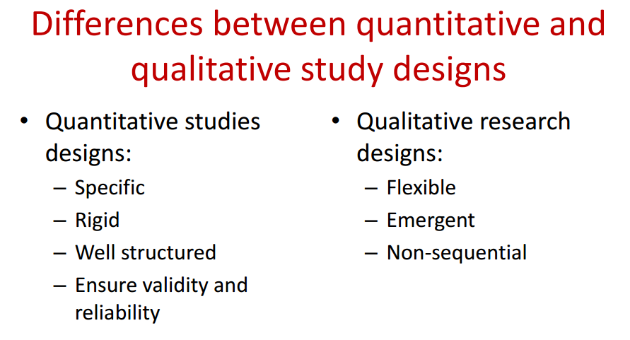
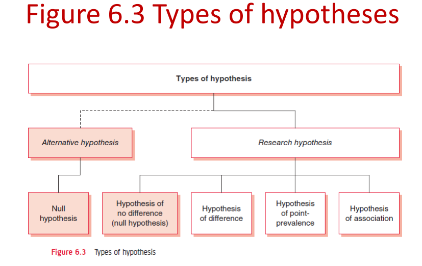
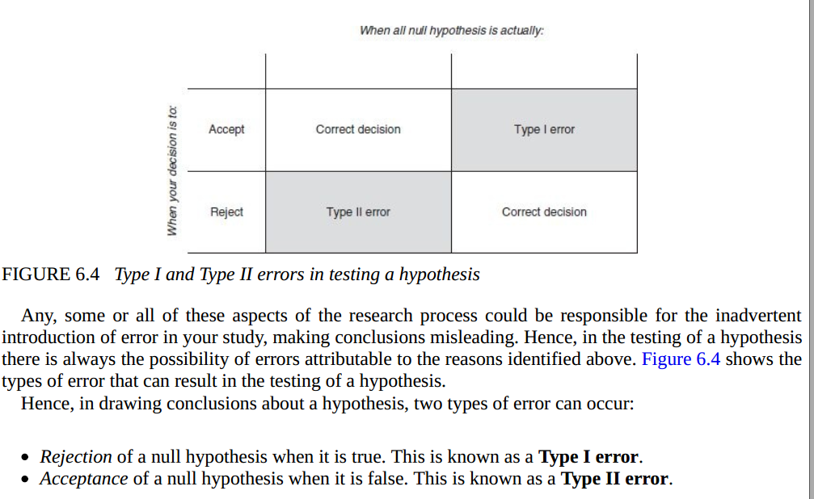
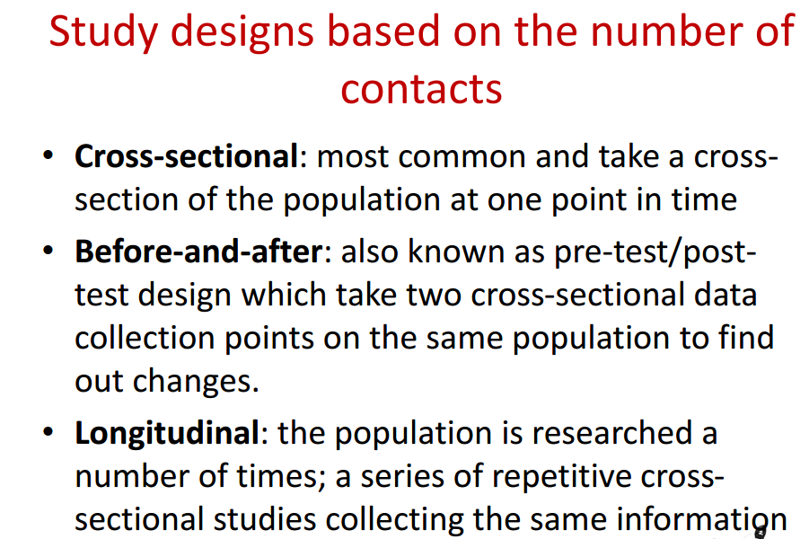
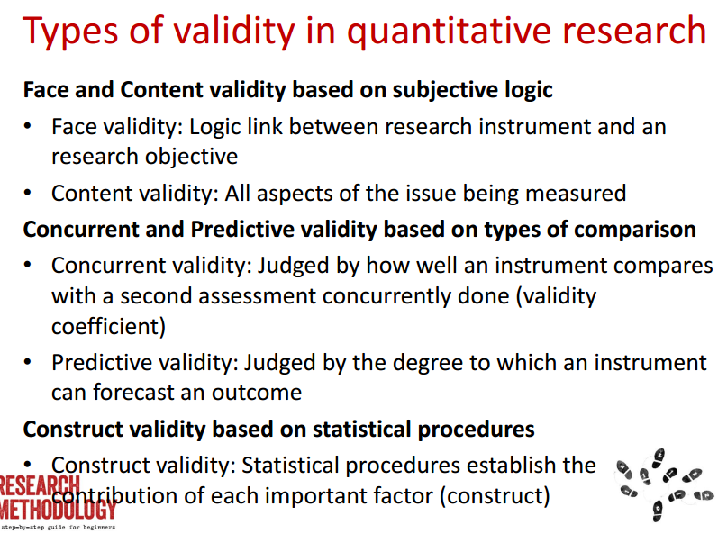

- #### Chapter 1 : 

  **Keywords: applied research, controlled, correlational research, descriptive**
  **research, empirical, explanatory research, exploratory research, evidence-based**
  **practice, interpretive paradigm, positivistic paradigm, pure research, qualitative**
  **research, quantitative research, reliability, research, structured and unstructured**
  **enquiries, systematic, validity**

- Research  :  Research is defined as the systematic and
  objective process of inquiry for aid in making
  decisions.

- Research: a way to gather evidence for your practice , Evidence-based practice (EBP) 

- Applications of research

  Research types  :  

  1. basic Research : expand the limits of knowledge , not involved in the solution
  2. Applied Reserarch :

- The research process: characteristics and requirements

- - - - Controlled (limited study of variables )
      - Rigorous (appropriate and justified)
      - Systematic – This implies that the procedures adopted to undertake an investigation follow a
        certain logical sequence
      - Valid and verifiable – This concept implies that whatever you conclude on the basis of your
        findings is correct and can be verified by you and others
      - Critical – Critical scrutiny of the procedures used and the methods employed is crucial to a
        research enquiry.


**Pure research** involves developing and testing theories and hypotheses that are intellectually challenging to the researcher but may or may not have practical application at the present time or in the future.

Most of the research in the social sciences is **applied**

**descriptive study** attempts to describe systematically a situation,
problem, phenomenon, service or programme, or provides information about, say, the living conditions
of a community, or describes attitudes towards an issue

**correlational study** is to discover or establish the existence of a
relationship/association/interdependence between two or more aspects of a situation What is the relationship between stressful living
and the incidence of heart attack? 

**Explanatory research** attempts to clarify why and how there is a relationship between two aspects of a situation or phenomenon. This type of research attempts to explain, for example, why stressful living results in heart attacks;

**exploratory research**. This is when a study is undertaken with the objective either to explore an area where little is known or to investigate the possibilities of undertaking a particular research study

The structured approach to enquiry is usually classified as q**uantitative research** and unstructured as **qualitative research**

#### Chapter 2 :  

**data, data display, data processing, empiricism, hypotheses, interview**
**schedule, non-probability sample, primary data, probability sample, qualitative**
**research, questionnaire, rationalism, reliability, research design, research instrument,**
**research objectives, research problem, research proposal, sample, sample size,**
**sampling design, secondary data, study design, unstructured interview, validity,**
**variables.**


**Phase I: deciding what to research**

Step I: formulating a research problem 

**Phase II: planning a research study**

Step II: conceptualising a research design

Step III: constructing an instrument for data collection

Step IV: selecting a sample

	``` 	Who will take part in your research?
	• Select appropriate sample/participants to
	represent the study population
	• Avoid bias
	• Random / probability samples
	• Non-random / non probability samples
	• Be aware of strengths and weaknesses of
	different sampling method


Step V: writing a research proposal

**Phase III: conducting a research study**

Step VI: collecting data

Step VII: processing and displaying data

```– Descriptive
– Quantitative (statistical procedures)
– Qualitative (narrative, content analysis)
– Attitudinal
```

Step VIII: writing a research report

#### Chapter 3:

**Keywords: catalogue, conceptual framework, contextualise, Internet, knowledge**
**base, literature review, search engines, summary of literature, thematic writing,**
**theoretical framework.*****

The place of the literature review in research

Bringing clarity and focus to your research problem

Improving your research methodology	

Broadening your knowledge base in your research area

Enabling you to contextualise your findings

- Searching for the existing literature

- Books  

- Journals

- Internet

  Developing a theoretical framework

  Developing a conceptual framework

   

  ### Chapter 4

  **concepts, dissect, operational definition, qualitative research,**
  **quantitative research, research objectives, research problem, study area, study**
  **population, subject area, validity, variable, working definition.**

- Considerations of selection research problem  :

  - Interest
  - Magnitude
  - Measurement of concept  
  - Level of expertise
  - Relevance
  - Availability of Data  
  - Ethical issues 

The formulation of research objectives

**Use four Ps:**
**– People**
**– Problems**
**– Programmes**
**– Phenomena**

Starts with action word: ‘to find out’, ‘to explore’

### Chapter 5

**Keywords: active variables, attribute variables, categorical variables, causation,**
**constant variables, continuous variables, dependent variables, dichotomous,**
**extraneous variables, independent variables, interval scale, intervening variables,**
**measurement scales, nominal scale, ordinal scale, polytomous, ratio scale, unit of**
**measurement**

In research terminology, change variables are called independent variables, outcome/effect variables
are called dependent variables, the unmeasured variables affecting the cause-and-effect relationship
are called extraneous variables and the variables that link a cause-and-effect relationship are called
intervening variables. Hence:

**Variables vs Concepts**

1. **Independent variable** – bringing about change(s) in a phenomenon or situation.
2. **Dependent variable** – the outcome or change(s) brought about by introduction of an independent
variable.
3. **Extraneous variable** – several other factors operating in a real-life situation may affect changes in
the dependent variable. T
4. **Intervening variable** – sometimes called the confounding variable), it links
the independent and dependent variables. 

**Active variables** – those variables that can be manipulated, changed or controlled.
**Attribute variables** – those variables that cannot be manipulated, changed or controlled

**constant variable** – has only one category or value, for example taxi, tree and water;
**dichotomous variable** – has only two categories, as in male/female, yes/no, good/bad, head/tail,
up/down and rich/poor;
**polytomous variable** – can be divided into more than two categories, for example religion
(Christian, Muslim, Hindu); political parties (Labor, Liberal, Democrat); and attitudes (strongly
favourable, favourable, uncertain, unfavourable, strongly unfavourable)

• Qualitative variables are like categorical variables such as gender: male/female Or Quantitative (interval and ratio scales)

• Nominal or classificatory scale, e.g. religion:
Christian, Muslim, Hindu, Jew, etc.
• Ordinal or ranking scale (categories in order)
e.g. socio economic status: upper/middle/low
• Interval scale (has equal units of
measurements with an arbitrary starting
point) e.g. Temperature in Fahrenheit
• Ratio scale (equal units of measurement with
fixed starting point at zero) e.g. height in cm

### Chapter 6

**Keywords: alternate hypotheses, hunch, hypothesis, hypothesis of point-prevalence,**
**null hypothesis, operationalisable, research hypothesis, Type I error, Type II error,**
**unidimensional, valid**

**Hypotheses** bring clarity, specificity and focus to a research problem,
but are not essential for a study

1. It is a tentative proposition.
2. Its validity is unknown.
3. In most cases, it specifies a relationship between two or more variables.

A hypothesis should be simple, specific and conceptually clear.

A hypothesis should be capable of verification.

A hypothesis should be related to the existing body of knowledge.

A hypothesis should be operationalisable.



Broadly, there are two categories of hypothesis:

1. research hypotheses;

2. alternate hypotheses.Its main function is
   **to explicitly specify the relationship that will be considered as true in case the research hypothesis**
   **proves to be wrong Conventionally, a null hypothesis, or hypothesis of no difference, is formulated as an alternate**
   **hypothesis**
   
   #### Null hypothesis H0
   • The null hypothesis states that there is no
   difference between two situations, groups,
   outcomes, or the prevalence of a condition or
   phenomenon
   
   



### Chapter 7 

**Keywords: chance variables, control group, experimental group, extraneous**
**variables, independent variable, matching, ‘maxmincon’ principle, random error,**
**randomisation, research design, study design, treatment group.**

A research design is a plan, structure and strategy of investigation so conceived as to obtain
answers to research questions or problems.

- conceptualise an operational plan to undertake the various procedures and tasks required to
  complete your study;
- ensure that these procedures are adequate to obtain valid, objective and accurate answers to the
  research questions

### Chapter 8

**Keywords: action research, after-only design, before-and-after study design, blind**
**studies, case studies, cohort studies, control studies, cross-sectional study design,**
**double-blind studies, experimental study design, feminist research, focus studies,**
**longitudinal studies, non-experimental studies, panel studies, prospective study**
**design, quasi-experimental studies, reflective journal, retrospective studies, semiexperimental studies, trend studies.**

- retrospective;
- prospective;
- retrospective–prospective.



• Non-experimental: Starting with the effect to
research the cause; a phenomenon is known
and the researcher attempts to establish what
caused it.
• Quasi- or semi-experimental: This design has
elements of both experimental and nonexperimental studies

### Chapter 9

**Keywords: closed questions, content analysis, double-barrelled questions, elevation**
**effect, error of central tendency, focus group, halo effect, Hawthorne effect, interview**
**schedule, leading questions, non-participant observation, open-ended questions, oral**
**history, participant observation, primary data, primary sources, questionnaire,**
**secondary data, secondary sources, structured interview, unstructured interview**

• Primary data: The researcher undertakes the
data collection
• Secondary data: The data is already available
and can be reanalysed

# chapter 10

Keywords: attitudinal scales, attitudinal score, attitudinal value, attitudinal weight,
cumulative scale, equal-appearing scale, Guttman scale, interval scale, Likert scale,
negative statements, neutral items, non-discriminate items, numerical scale, ordinal
scale, positive statements, ratio scale, summated rating scale, Thurstone scale

Types of attitudinal scales
• The summated rating scale, also known as the
**Likert scale;** -Measures in categories or on a numerical scale

• The equal-appearing interval scale or
differential scale, also known as the **Thurstone**
**scale**; -Interval scale
• The cumulative scale, also known as the
Guttman scale.- **Ratio Scale**

# Chapter 11

Keywords: concurrent validity, confirmability, construct validity, content validity,
credibility, dependability, external consistency, face validity, internal consistency,
reliability, transferability, validity

Trustworthiness and authenticity
Four indicators that reflect validity and reliability
in qualitative research:
• Credibility
• Transferability
• Dependability
• Confirmability



# chapter 12

Keywords: accidental sampling, cluster sampling, data saturation point,
disproportionate sampling, equal and independent, estimate, information-rich,
judgemental sampling, multi-stage cluster sampling, non-random sample, population
mean, population parameters, quota sampling, random numbers, random sample,
sample statistics, sampling, sampling design, sampling element, sampling error,
sampling frame, sampling population, sampling unit, sample size, sampling strategy,
saturation point, snowball sampling, study population, stratified sampling, systematic
sampling

**Specific random/probability sampling designs**

- Simple random sampling (SRS) 
  - Each element in the sampling frame has an equal
    and independent chance of selection in the sample
- Stratified random sampling
- Cluster sampling 

**Non-random/non-probability sampling designs in quantitative research**

1. quota sampling;
2. accidental sampling;
3. judgemental sampling or purposive sampling;
4. expert sampling;
5. snowball sampling.

# Chapter 13

Keywords: conceptual framework, data analysis, data processing, hypothesis,
limitations, literature review, research design, research problem, sampling, study
design, study objectives, theoretical framework, time-frame.

• A literature review is an integral part of the
research process
• Providing a theoretical background to a study:

1. Searching for the existing literature in the
area of interest
2. Reviewing the selected literature
3. Developing a theoretical framework
4. Developing a conceptual framework


# Chapter 14

Keywords: bias, code of conduct, confidentiality, deprivation of treatment, ethos,
harm, informed consent, principles of conduct, research participants, sensitive
information, sponsoring organisations, stakeholders, subjectivity